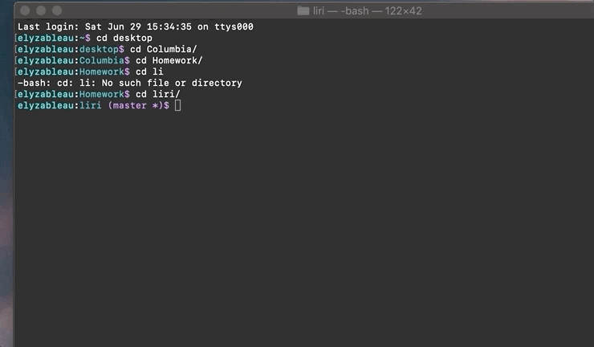

# LIRI

### SIRI has been an interesting invention. She is a Speech Interpretatin and Recognition Interface who listens to what we want and makes it happen. But she sure doesn't do what I want in my terminal! 

### So, here is LIRI, a Language Interpretation and Recognition Interface to the rescue! Need to know what that new song sounds like from your favorite artist? Did you want to know when they're next playing at your fav venue? Or that horrible movie they decided to do? Just ask LIRI!

### This app is organized by choosing to Spotify a song and gather some info, find a concert near you with Bands In Town and logistics, find info about your favorite movie using OMDB, or have LIRI find you a special song.

--------------------------------------------------------------------------------------

### To start, type "node liri" into your terminal.

### LIRI will greet you and ask to type "node liri" and then one of the following commands: 

#### concert-this
#### spotify-this-song
#### movie-this
#### do-what-it-says

### For instance, if you want information about a song, type: node liri spotify-this-song

### LIRI will then ask you, "What song do you want to know about?" Type what song you are curious about and press enter!
####            Spotify will retrieve one choice for the song queried.

### The same goes for "node liri concert-this" and "node liri movie-this"

### do-what-it-says will bring you back a special song from Spotify!
---------------------------------------------------------------------------------------
## See it in action:
### LIRI Welcome

### Spotify this Song

### Concert This

### Movie This

### Do What LIRI Says

### The technologies used in this app:
#### node.js
#### Spotify API
#### Axios
#### Bands in Town API
#### OMDB API
#### Inquirer

##### I was the sole contributor to this app.